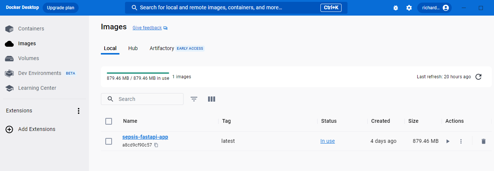
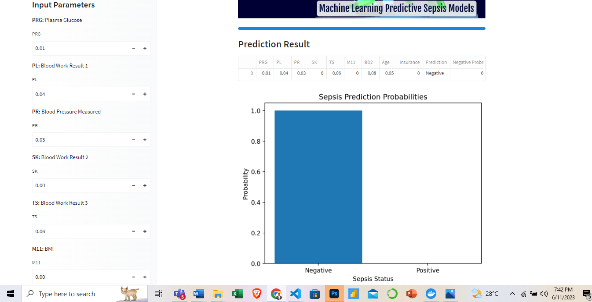

# Sepsis_Classification_Machine_Learning_API_using_FastAPI

# 👋Overview
The project was aimed at exploring Trends and Predictors in Patient Data to Uncover the Secrets of Sepsis Occurances. Machine Learning was built provide accurate and efficient classification of sepsis cases using the **FastAPI** framework and **Docker**.

# 📂Project Objective
The objectives of the project are as follows:
- Train a machine learning model on a diverse dataset of sepsis cases to accurately predict the likelihood of sepsis in patients.

- Utilize the FastAPI framework to create a user-friendly and efficient web interface for healthcare professionals to interact with the sepsis classification model.

- Improve diagnostic capabilities by achieving high accuracy, sensitivity, and specificity in sepsis classification.

- Provide a comprehensive and scalable solution that can be easily deployed in real-time healthcare environments.

## Summary
| Code | Name                                                | Published Article                                                                                          | Deployed App                                                                                                 | Streamlit App                                                                                                |
|------|-----------------------------------------------------|------------------------------------------------------------------------------------------------------------|--------------------------------------------------------------------------------------------------------------|-------------------------------------------------------------------------------------------------------------|
| LP6  | Sepsis Prediction App with FastAPI and Streamlit     | [📚Medium Article ](https://medium.com/@richmensah1997/predicting-sepsis-status-of-patients-using-machine-learning-model-fa848fce0fe8) | [MY FastAPI App](https://huggingface.co/spaces/RICHARDMENSAH/Sepsis-Prediction-APP-using-FASTAPI-and-Machine-Learning)                        | [MY Streamlit App](https://huggingface.co/spaces/RICHARDMENSAH/SEPSIS-PREDICTION-STATUS-APP)                    |


## 📫 Dataset USED

The data used in this project consists of a diverse collection of sepsis cases obtained from **[Sepsis](https://www.kaggle.com/datasets/chaunguynnghunh/sepsis?select=README.md)**.

## 👤 Data Fields

| Column Name | Data Features | Description                                      |
|-------------|-----------------|--------------------------------------------------|
| ID          | N/A             | Unique number to represent patient ID             |
| PRG         | Attribute 1     | Plasma glucose                                   |
| PL          | Attribute 2     | Blood Work Result-1 (mu U/ml)                    |
| PR          | Attribute 3     | Blood Pressure (mm Hg)                           |
| SK          | Attribute 4     | Blood Work Result-2 (mm)                         |
| TS          | Attribute 5     | Blood Work Result-3 (mu U/ml)                    |
| M11         | Attribute 6     | Body mass index (weight in kg/(height in m)^2)   |
| BD2         | Attribute 7     | Blood Work Result-4 (mu U/ml)                    |
| Age         | Attribute 8     | Patient's age (years)                            |
| Insurance   | N/A             | If a patient holds a valid insurance card         |
| Sepsis      | Target          | Positive: if a patient in ICU will develop sepsis,<br> Negative: otherwise |


# 🌱 Hypotheses
- **Hypothesis 1:** Higher plasma glucose levels (PRG) are associated with an increased risk of developing sepsis.

- **Hypothesis 2:** Abnormal blood work results, such as high values of PL, SK, and BD2, are indicative of a higher likelihood of sepsis.

- **Hypothesis 3:** Older patients are more likely to develop sepsis compared to younger patients.

- **Hypothesis 4:** Patients with higher body mass index (BMI) values (M11) have a lower risk of sepsis.

- **Hypothesis 5:** Patients without valid insurance cards are more likely to develop sepsis.

The above hypothesis aided in providing more insight for further analysis

## 📫 API Documentation
API documentation can accessed  by visiting the /docs endpoint after starting the server (http://localhost:8000/docs).


## 🔭 Docker Container
Below is a screenshot of my **FASTAPI** runing successfully in my docker desktop using 

```bash
docker build -t your-image-name .
```

```bash
docker run -d -p 8080:8000 your-image-name
```



## 👯 STREAMLIT APP PREDICTED RESULTS
Below is an interface of predicted results in streamlit




## Contact
`Richard Mensah`

`Data Analystics Professional`

`Azubi Africa`

[](https://www.linkedin.com/in/richard-mensah-ab8564190/) 

